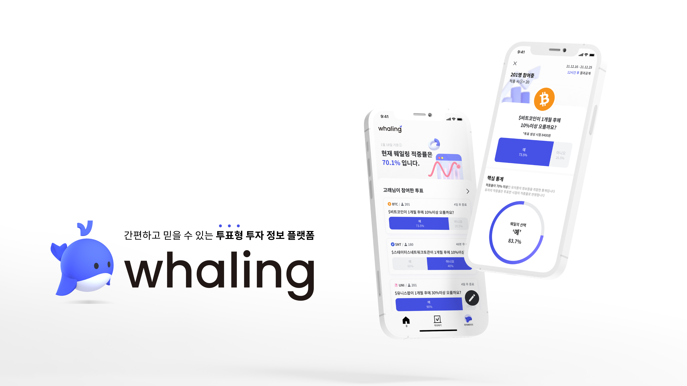

# Whaling Server

**[웨일링 홈페이지(Whaling)](https://whaling.co.kr)**

가상화폐 투표 서비스 웨일링의 Backend Server Repository입니다.

가상화폐 시세 기준 :  [Upbit](https://upbit.com/home)

## 기술 스택

### Infra

|Docker|Github Actions|
|:---:|:---:|
||

### DataBase

|MySQL|RDS|S3|
|---|---|---|
|||

### Web Server

|EC2|ELB|Django|Nginx|gunicorn|
|---|---|---|---|---|
|||||

### Tracking

|Celery|RabbitMQ|Upbit
|---|---|---|
|||

# Feature

## API

[웨일링 API 링크](https://documenter.getpostman.com/view/18244416/UVXqDXg3)

### User

- 카카오톡 로그인 / 회원가입 / 토큰 검증
- 닉네임 중복 체크 / 변경
- 생성한 투표 목록 조회
- 참여한 투표 목록 조회

### Votes

- 투표 생성 / 참여
- 전체 투표 목록 조회
- 투표 상세 조회
- 서비스 전체 적중률 조회

### Coin

- 전체 코인 목록 조회

## Tracking / Update

Coin Update / Tracking Server Repository : [whaling-coin-server](https://github.com/team-whaling/whaling-coin-server)

### 코인 트래킹 서버를 따로 둔 이유

- EC2 프리티어가 트래픽과 트래킹을 동시에 수행하기에 성능 문제가 발생할 수 있다.
- 트래킹 서버가 다운이 되더라도 웹 페이지 접속은 될 수 있도록 한다.

### 트래킹 서버에서 수행하는 것

- 코인 가격 / 이미지를 API로 넘겨준다.
- 투표 마감 기한 / 트래킹 기한에 따라서 투표 정보를 업데이트
- 정답 여부에 따라서 유저에게 고래밥 지급
- 투표 결과에 따라서 전체 적중률 / 유저 적중률 수정

## Developer

|&nbsp;|정환우|권민아|
|:---:|:---:|:---:|
|역할|코인 서버 구축 트래킹 기능 구현  도메인 서버 배포|소셜 로그인 메인 서버 구축 API 서버 담당|
|Profile|Github Link: [sossont](https://github.com/sossont)| Github Link : [mingulmangul](https://github.com/mingulmangul)

# 회고

## 아쉬운 점

- 트래킹 서버를 따로 설계할 때, nginx를 굳이 사용하지 않아도 되는데 잘못 설게하여 nginx를 사용해서 API를 따로 만들었다. 처음부터 Multi Database를 사용했다면 nginx를 사용하지 않아
  API를 생성하지 않아도 됐을 것이라는 생각. 한 번에 처리할 수 있는 것을 두번에 나눠 처리하는 것이니...
