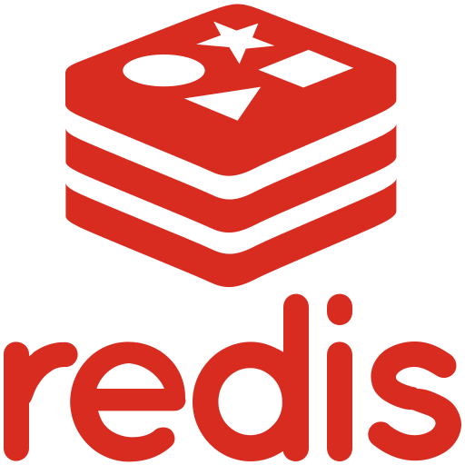

# Whaling Server

## 소개

**[웨일링 홈페이지(Whaling)](https://whaling.co.kr)**

가상화폐 투표 서비스 웨일링의 Backend Server Repository입니다.

가상화폐 시세 기준 :  [Upbit](https://upbit.com/home)

## 기술 스택

### Infra

|Docker|Github Actions|
|:---:|:---:|
||

### DataBase

|MySQL|RDS|S3|
|---|---|---|
|||

### Web Server

|EC2|ELB|Django|Nginx|gunicorn|
|---|---|---|---|---|
|||||

### Tracking

|Celery|Redis|Upbit
|---|---|---|
|||

## Feature

### Tracking / Update

Coin Update / Tracking Server Repository : [whaling-coin-server](https://github.com/team-whaling/whaling-coin-server)
 
 
**서버를 2개 둔 이유**
 

EC2 프리 티어를 사용하여 CPU 성능이 좋지 않아 유저 트래픽과 트래킹을 동시에 감당하기에는 부담이 있었습니다.  
그래서 코인 가격 업데이트 서버에서 메인 서버 데이터베이스에 접근하여 트래킹 및 투표 결과 업데이트까지 담당하도록 하였습니다.  
이렇게 서버를 2개 구축한다면 결과가 업데이트가 되지 않는 버그가 발생하더라도 사이트 자체가 다운되지는 않기 때문에 유저 입장에서는 체감하기 힘들게 하는 것이 서비스에 좋을 것이라 판단하였습니다.  
자세한 동작 방식은 레포지토리에 정리하였습니다.

### API

추후 업뎃 예정

## Developer

|&nbsp;|정환우|권민아|
|:---:|:---:|:---:|
|역할|코인 서버 구축 트래킹 기능 구현  도메인 서버 배포|소셜 로그인 메인 서버 구축 API 서버 담당|
|Profile|Github Link: [sossont](https://github.com/sossont)| Github Link : [mingulmangul](https://github.com/mingulmangul)
